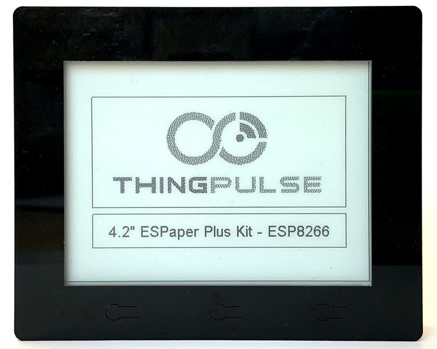

# 4.2″ ESPaper Plus Kit

How to setup the [ThingPulse 4.2″ ESPaper Plus Kit](https://thingpulse.com/product/4-2″-espaper-plus-kit-wifi-epaper-display/).

---

The ThingPulse 4.2" ESPaper device comes with a firmware flashed ready to use with our web application at [https://www.espaper.com](https://www.espaper.com). It allows to define the screen content conveniently in the browser in an editor or by using predefined templates. According to your schedule the device will wake up, connect to WiFi, and download the latest screen content from the ESPaper server. 

The instructions below guide you through the setup process.

First, head over to [https://www.espaper.com](https://www.espaper.com) and create an account. You can either use email and password for authentication or use one of the social login options.

## Connecting Device to the Internet
- Charge the device
- Push and hold the left button while turning the device on with the power switch
- The device will enter configuration mode. Follow the instructions on the device screen: 
	- Connect your phone or laptop WiFi to "ESPaperConfig" and open the browser at http://192.168.4.1
	- Enter your local WiFi credentials (SSID and password) in the form. Also define wakeup interval and timezone. 
	- Click the "Save" button.
- Push the right button (reset) on the device to restart it.

## Pairing Device with espaper.com Account
If you have not created an account on espaper.com yet do so now.

- After restart the device will be showing a pairing screen with a one-time password
- Now open your browser at [https://www.espaper.com](https://www.espaper.com) and login
- Click the "Register Device" button.
- Enter the one time password displayed on the device.
- Claim the device if the presented information matches.

## Defining Device Content
- Click on the "Screen" button for the device paired in the previous step.
- Start defining the content of the screen by
	- adding static elements like lines, rectangles, circles, icons or static text
	- Using a predefined template from the "Widgets" tab. You can extend the available templates by adding applications, e.g. for iCal calendars or weather information.
- Save the editor content. The device will show the content with the next update. You can trigger an update by either waiting for the update interval to finish or by pressing the reset button on the device.
