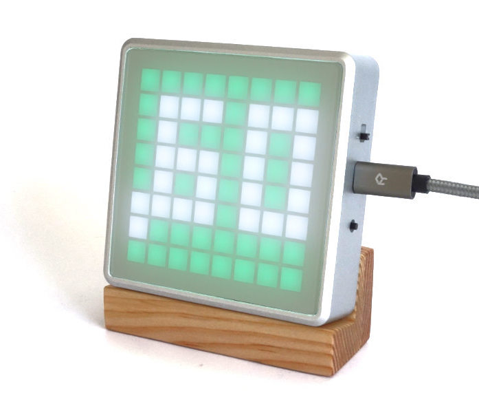
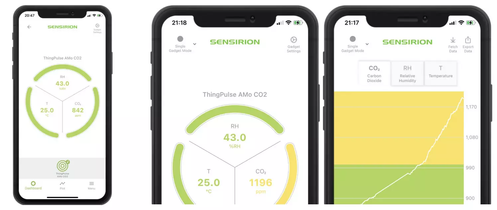

# AMo - CO2 Monitor

How to use and configure the [ThingPulse AMo](https://thingpulse.com/product/amo-co2-monitor/) CO2 monitor.

## Using the AMo

The AMo is a true plug & play device. Connect it to a power source through the Micro-USB connector, turn it on, and you 
are good to go. The premium CO2 sensor will self-calibrate within a couple of minutes.

**The 10second manual:** use the push button on right side to turn off/on acoustic warning.

Read on for the full manual.

### CO2 readings on display

The way the measured CO2 readings are displayed is specifically tuned to the characteristics of the 8x8 LED 
display. The values displayed by the AMo are 1/1000 of the actual reading rounded to 1 or 2 fractional digits 
omitting the leading 0. Consequently, the AMo will always display 2 digits in total (see examples below).

CO2 is measured in "ppm", [parts per million](https://en.wikipedia.org/wiki/Parts-per_notation). Following 
the start of the Industrial Revolution, atmospheric CO2 concentration increased to over 400 parts per 
million and continues to increase (causing the phenomenon of global warming). Hence, during normal operation you will 
not see readings below 400ppm. 

**Examples:**

- 603ppm → .60
- 613ppm → .61
- 615ppm → .62
- 994ppm → .99
- 995ppm → 1.0
- 1249ppm → 1.2
- 1250ppm → 1.3

### Monitoring CO2 levels & alerting

The AMo uses a monitoring approach borrowed from traffic lights. Depending on the level of CO2 the 
background color on the display changes from green to yellow and then to red. In addition, at the yellow and red stages 
the screen flashes slowly or quickly respectively. On top of that the integrated speaker beeps every 10s when
CO2 concentration reached the red level. See table below.

There is an ongoing scientific debate as to what the "healthy" indoor CO2 range is i.e. at what level you
should ventilate your office, classroom, restaurant, etc. As long as clear guidelines are missing ThingPulse decided to
configure the AMo with conservative (i.e. cautious) defaults.

Side note: effects of too much CO2 (or too little oxygen actually) include fatigue and headache.

| CO2 | color  | display flashing | acoustic warning |
|----------------|--------|------------------| -----------------|
|  <850ppm       | green  | -                | -                |
|  850-1000ppm   | yellow | slow             | -                |
|  >1000ppm      | red    | quick            | every 10s        |

### Turning off acoustic alerting

We understand that in certain environments it may be undesirable to disturb occupants with acoustic alerts. Using the 
push button on the right side allows to turn it off - and on again. After pushing the button the AMo will briefly
display one of the two speaker icons below to indicate whether acoustic alerting is off or on.

## Mobile apps

AMo is a fully compliant Sensirion Smart Gadget. Install the MyAmbience app for iOS and Android to visualize and 
monitor sensor data on your mobile device.

## Configuring the AMo

Should you want to adjust the monitoring levels, LED brightness or speaker volume you can download and run the 
[ThingPulse App Fairy](https://github.com/ThingPulse/app-fairy) application. It will completely replace the existing
firmware with the one you configured in the App Fairy. 

!!! warning
    Proceed with caution! Although the process is fairly simple and robust malfunctions can not be ruled out. Reach out 
    to us if you get stuck.

- As a precondition please [install](/how-tos/install-drivers/) the Silicon Labs Serial-to-USB driver on your computer 
  or Mac.
- Connect the AMo to your computer or Mac over USB and turn it on.
- Start the App Fairy.
- Select "Icon64" as device type and "CO2 Monitor" as application.
- In the configuration dialog enter `scd4x` for sensor type
