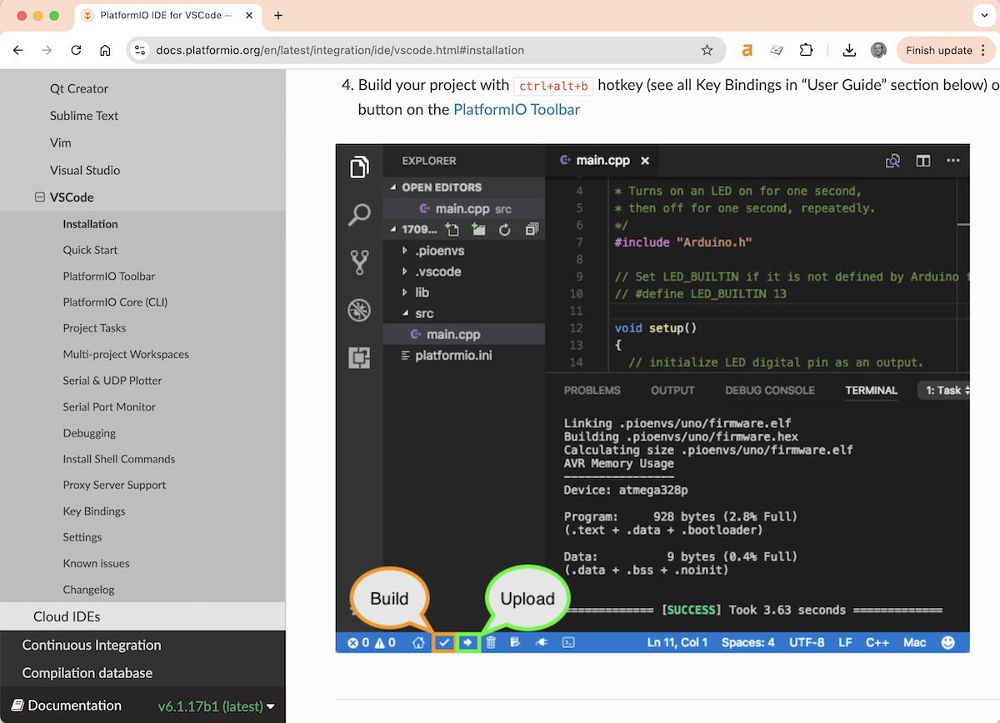

# Development Environment

We will be working with a **PlatformIO** (PIO) development environment in **Visual Studio Code** (VS Code).
If you have never worked with PlatformIO, please install it as per their [installation instructions](https://docs.platformio.org/en/latest/integration/ide/vscode.html#installation).

## Installation Steps

0. [Download](https://code.visualstudio.com/) and install official Microsoft Visual Studio Code. PlatformIO IDE is built on top of it
1. Open VSCode Package Manager
2. Search for the official platformio ide extension
3. Install PlatformIO IDE.

Now please look at their [quick-start guide](https://docs.platformio.org/en/latest/integration/ide/vscode.html#quick-start):

## Video Tutorial

See the [Video Tutorials](video-tutorials.md) page for an instructional video on setting up the development environment.
