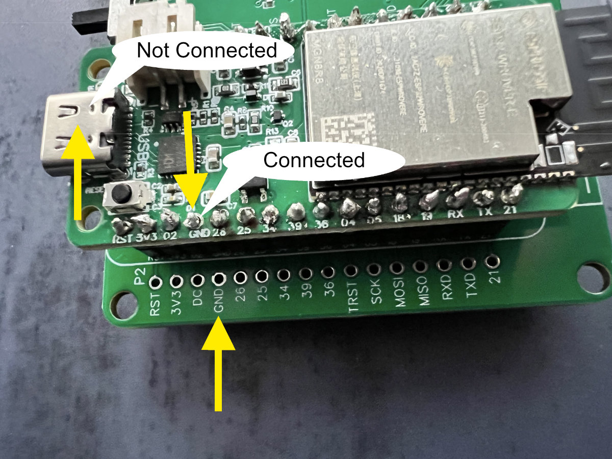
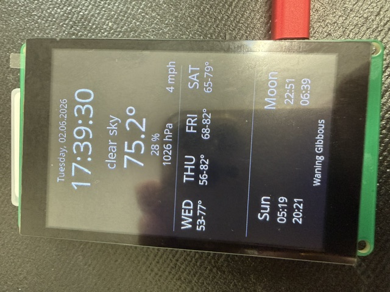
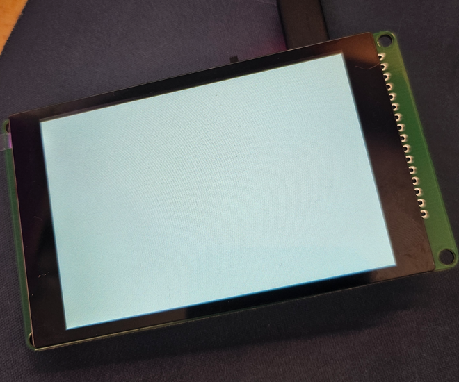
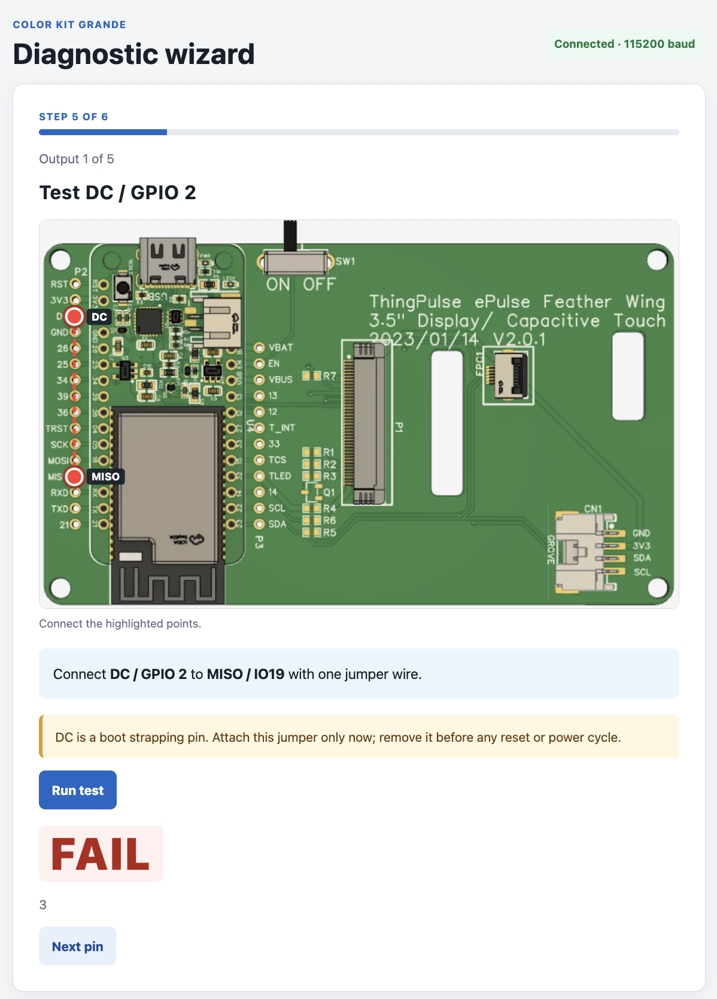

# Troubleshooting

| Symptom | Suggested Solution | Image |
|---------|---------------------|-------|
| After uploading filesystem and firmware the display flickers but stays dark  | This problem could often be resolved by redoing cold solder joints. If you own a multimeter you can check connections between the ePulse Feather board and the bigger connector board, pin by pin. The ground pin (GND) allows you to do an even better test: check if the metal housing of the USB-C plug is electrically connected to the GND pin on the big board. If there is no connection you should try to heat the solder joint again to properly connect the pin to the pad | [](../../img/guides/color-kit-grande/trouble1.jpg) |
| The display shows text but no icons  | This probably means that the filesystem upload was not successful, as the icons are loaded from there. Make sure that you have followed the [Upload the file system to device](weather-station.md#upload-the-file-system-to-device) step | [](../../img/guides/color-kit-grande/trouble2_ckg_no_icons.jpeg) |
| The display shows a white screen  | This is most likely caused by a bad solder joint. Check these pins for cold solder joints:<br><ul><li>TFT_DC (IO02)</li><li>TFT_RESET (IO04)</li><li>TFT_SCK (IO05)</li><li>TFT_MOSI (IO18)</li><li>TFT_MISO (IO19)</li><li>TFT_CS (IO15)</li></ul>Also check these which can be involved:<ul><li>TFT_LED (IO32)</li><li>3V3</li><li>GND</li></ul> | [](../../img/guides/color-kit-grande/trouble3_ckg_white_screen.png) |
| Board powers on (LEDs lit) but does not show up as USB device on the computer | If the board receives power but the USB interface never enumerates (no COM port, no new device in Device Manager), try these steps:<br><ul><li>**Disconnect the ePulse Feather from the connector board** and try flashing it standalone. The connector board might have a short that affects USB communication.</li><li>**Check the TX and RX pins** for solder bridges that might affect serial communication.</li><li>**Inspect all solder joints** on both top and bottom of the boards. Reheating problematic joints frequently fixes the issue.</li><li>Make sure you are using a **USB data cable**, not a charge-only cable.</li><li>Make sure the CH9102F USB-to-serial driver is installed. Follow [Adafruit's CH9102F driver installation guide](https://learn.adafruit.com/how-to-install-drivers-for-wch-usb-to-serial-chips-ch9102f-ch9102) if needed.</li></ul> | |

## Self-Test Tool

We provide an online [Self-Test Wizard](https://ckg-self-test.thingpulse.com/) that helps you diagnose issues with your Color Kit Grande.

[](https://ckg-self-test.thingpulse.com/)

### How to use the Self-Test

1. **Remove both FPC ribbon cables** from the connector board (display and touch)
2. Use a **jumper wire** to connect the two test pads indicated on the connector board
3. Follow the instructions in the [Self-Test Wizard](https://ckg-self-test.thingpulse.com/)

### About Quality Assurance

All boards are flashed with a self-test firmware and the displays are verified in a test harness before shipping. This means that at the time of shipping, all components were confirmed to be working correctly.

**Most issues are caused by bad solder joints** that can occur during assembly. These can typically be fixed by:

- **Re-heating** the problematic solder joint with your soldering iron
- Using a **solder wick** to remove excess solder
- Using a **de-solder pump** to clean up bridges or shorts

When in doubt, carefully inspect all solder joints on both the top and bottom of the boards, and reheat any that look dull, lumpy, or don't have a proper cone shape.

## Contact Support

If none of the above measures resolved your issue, please contact us at **info AT thingpulse.com**. 

To help us diagnose the problem quickly, please include the following information in your email:

```
Subject: Color Kit Grande - Troubleshooting Help

Hi ThingPulse Support,

I am having issues with my Color Kit Grande and need assistance.

**Symptom:**
[Describe what happens - e.g., display stays dark, white screen, no USB connection, etc.]

**What I have tried:**
- [ ] Inspected and reheated solder joints
- [ ] Checked for solder bridges on TX/RX pins
- [ ] Tested with different USB cables
- [ ] Disconnected ePulse Feather from connector board
- [ ] Ran the Self-Test Wizard
- [ ] Other: ___

**Attached photos:**
Please find attached in-focus photos of:
- Top side of the connector board (all solder joints visible)
- Bottom side of the connector board
- Top side of the ePulse Feather board
- Bottom side of the ePulse Feather board

Thank you for your help!
```

!!! tip "Photo Tips"
    Good lighting and sharp focus on the solder joints help us identify issues quickly. We can often spot problematic pins in photos that might not be obvious in person.
