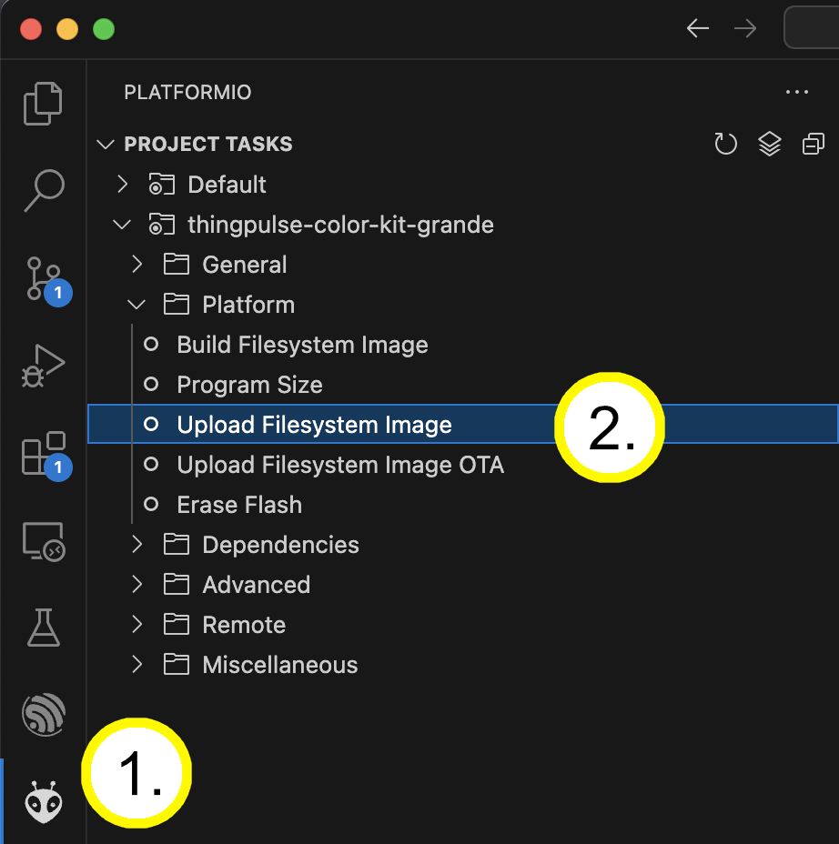
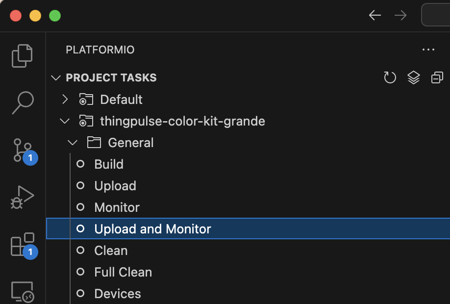

# Weather Station Project

With all the soldering done we will turn to the Weather Station Touch project.

## Obtain the code

The Weather Station sample project is, as all of ThingPulse's open-source code, publicly accessible on GitHub.
Hence, there are two options to download the code:

- Clone the repository with Git: `git clone https://github.com/ThingPulse/esp32-weather-station-touch`
- Download the sources from https://github.com/ThingPulse/esp32-weather-station-touch/archive/master.zip and unpack
  them somewhere to your local file system.

## Open project in Visual Studio Code

- Start VS Code
- ==File== > ==Open Folder...==
- Find and select the `esp32-weather-station-touch` folder from the previous step.

## Configuration & customization

Open the `src/settings.h` file and adjust the two handful of configuration parameters in the "User settings" section at the top.
They are all documented _inside_ the file directly.
Everything should be self-explanatory.
Most importantly you will need to set the OpenWeatherMap API key ([how to get key](../../how-tos/openweathermap-key.md)).

## Upload the file system to device

- Hit the PlatformIO icon on the navigation bar on the left side (alien face).
- Select the ==Platform== > ==Upload Filesystem Image== task.
You only need to do this once if it succeeds.
Pay attention to the output in the VS Code console that opens.
If it reports any errors like e.g. if it cannot connect to the board or if stops midway, then repeat the process.

## Upload code to device

- Select the ==General== > ==Upload and Monitor== task.
You do this **every time you change code or configuration**. 

Alternatively you can also use the quick buttons from the footer:

!!! note

    Should the upload fail, please ensure your system has the necessary drivers for the CH9102 USB to serial converter installed.
    The best place for details and instructions is over at [Adafruit](https://learn.adafruit.com/how-to-install-drivers-for-wch-usb-to-serial-chips-ch9102f-ch9102).
