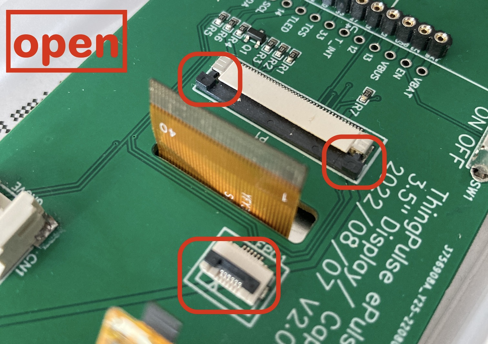
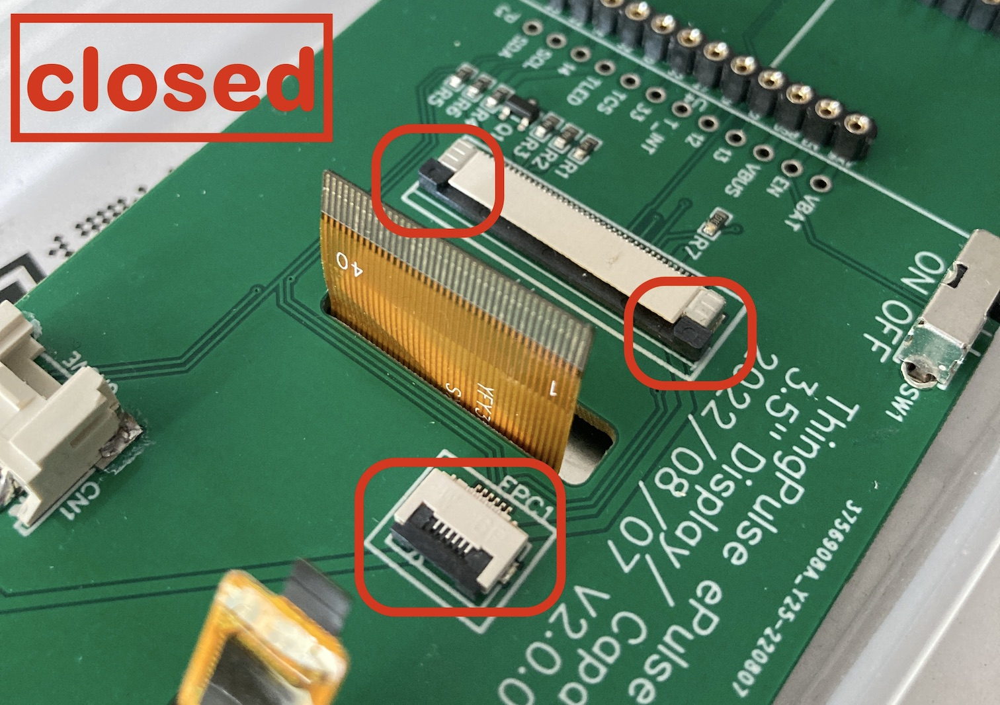
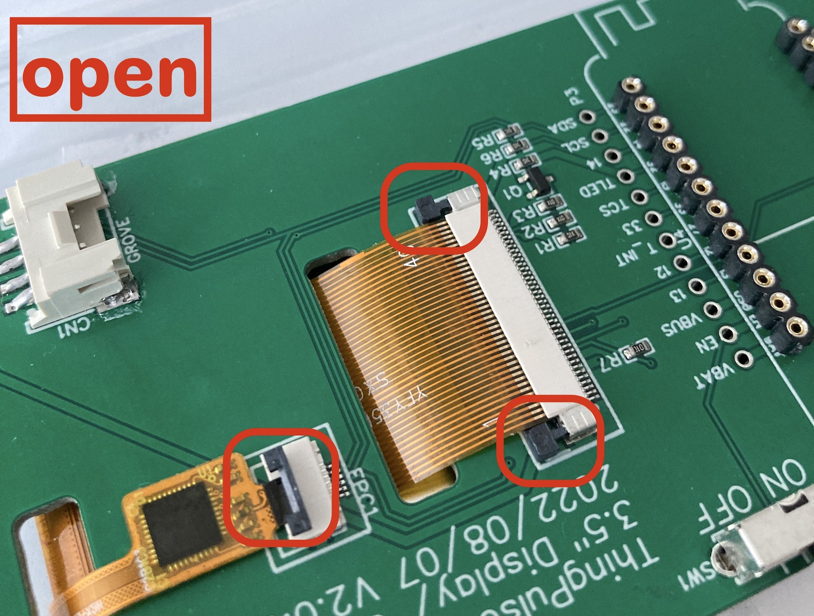
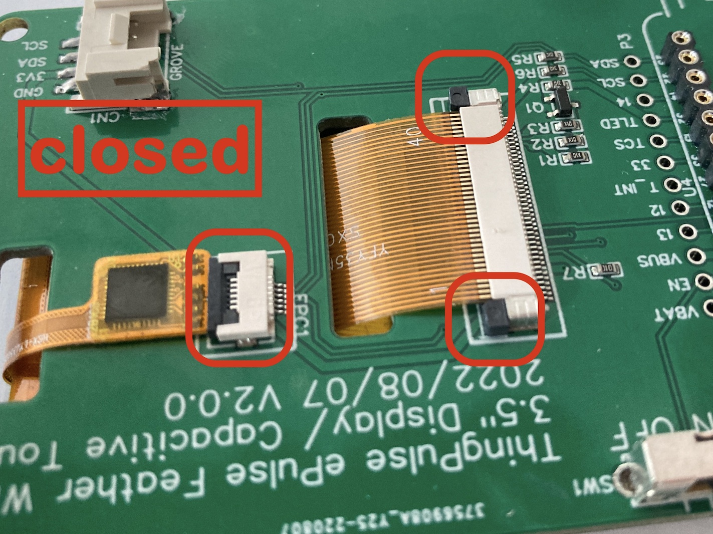

# ESP32 Color Kit Grande

How to assemble and program the [ThingPulse ESP32 WiFi Color Display Kit Grande](https://thingpulse.com/product/esp32-wifi-color-display-kit-grande/).

!!! note

    It is advisable to read these instructions carefully *before* you start soldering.
    In particular please make sure that you have all parts and tools ready.

In addition to the components in the kit you will need:

- [soldering iron](https://thingpulse.com/go/soldering-iron/)
- solder
- tweezers

## Assembling the hardware

There are different ways to skin a cat.
The recipe below is what we think is most sensible for most people.
Read it, take a step back, read it again and see if it makes sense for you, too.
Feel free to adjust it if it does not.

As seen on our product page in the shop the intention is for the ESP32 microcontroller board to be pluggable rather than soldered to the connector PCB.
If you are concerned about the little extra height this adds to the whole assembly, you may of course solder the ESP32 board directly to the connector PCB using the male pin headers.
You might need to cut off the pin headers on the other side of the connector PCB such that they will not touch the display module.

!!! note

    See the [dedicated chapter below](#operating-the-fpc-connectors) about how to open & close the FPC connectors.

!!! danger

    Handle the delicate display unit and its FPC ribbons with extra care.
    Be sure to NOT sharply bend (i.e. fold), pull or otherwise apply stress to the ribbon cables and their connection to the unit.

1. Cut the female pin headers strips to length (12 & 16 pins) and solder them to the connector PCB.
See video tutorial below (collapsible section).
2. OPTIONAL but recommended: solder the on/off switch to PCB.
Will be tricky to add later after the display module is attached to the PCB.
3. OPTIONAL: solder the Grove connector to the PCB.
See "SMD soldering" video tutorial below (collapsible section).
Can easily be added later anytime.
4. Cut the male pin headers strips to length (12 & 16 pins) and solder them to the ESP32 board.
5. Peel off the protective film on one side of the four foam stickers and attach them to the front of the connector PCB in the designated areas ("TAPE").
6. Place the display on a clean surface upside down (as to not scratch it).
7. Feed the two FPC cables of the display module through the cut-outs of the PCB.
Do not insert the cables into the sockets yet.
8. Flip the two pieces over to verify everything fits.
9. Remove the display module again.
10. Remove the remaining protective film from the foam stickers.
11. Feed the FPC cables of the display module through the PCB and attach the display module such that it aligns with the markings on the PCB (while silk screen).
See the [dedicated chapter below](#operating-the-fpc-connectors) on how to correctly open & close the FPC connectors.

<iframe width="480" height="300" src="https://www.youtube.com/embed/AL6-BsUyV6k" title="YouTube video player" frameborder="0" allow="accelerometer; autoplay; clipboard-write; encrypted-media; gyroscope; picture-in-picture; web-share" allowfullscreen></iframe>

??? tip "Expand to show soldering tutorials"

    === "Working with pin headers"
        General introduction to working with pin headers incl. how to solder them.
        <iframe width="560" height="315" src="https://www.youtube.com/embed/qz9Ryos1_GY" title="YouTube video player" frameborder="0" allow="accelerometer; autoplay; clipboard-write; encrypted-media; gyroscope; picture-in-picture; web-share" allowfullscreen></iframe>

    === "Soldering SMD components"
        Detailed instructions how to solder SMD components.
        Recommended for soldering the Grove connector if you have never done any SMD soldering before.
        <iframe width="560" height="315" src="https://www.youtube.com/embed/EW9Y8rDm4kE" title="YouTube video player" frameborder="0" allow="accelerometer; autoplay; clipboard-write; encrypted-media; gyroscope; picture-in-picture; web-share" allowfullscreen></iframe>

### Operating the FPC connectors

The connectors for the two FPC cables (for display and touch module) can be a bit tricky to operate for the inexperienced.
The fact that the two types required here don't work the same does not help.

- The small one for the touch module has a black latch that opens if you gently lift it such that it will protrude from its base in a 90° angle.
- The large one for the display has a locking bar that runs along the full length of the connector.
It needs to be pulled away from its base parallel to the PCB.
*Use two fingers* to pull at the knobs on either end of the bar.

The following pictures indicate the open/closed positions.

|  |  |
|-----------------------------------------------------------------------------------------------------------------------------------|---------------------------------------------------------------------------------------------------------------------------------------|
|              |              |

## Development environment
We will be working with a **PlatformIO** (PIO) development environment in **Visual Studio Code** (VS Code).
If you have never worked with PlatformIO, please install it as per their [installation instructions](https://platformio.org/install/ide?install=vscode).
Once done, walk through their minial "Getting Started" section.

## Sample project

With all the soldering done we will turn to the Weather Station Touch project.

### Obtain the code

The Weather Station sample project is, as all of ThingPulse's open-source code, publicly accessible on GitHub.
Hence, there are two options to download the code:

- Clone the repository with Git: `git clone https://github.com/ThingPulse/esp32-weather-station-touch`
- Download the sources from https://github.com/ThingPulse/esp32-weather-station-touch/archive/master.zip and unpack
  them somewhere to your local file system.

### Open project in Visual Studio Code

- Start VS Code
- ==File== > ==Open Folder...==
- Find and select the `esp32-weather-station-touch` folder from the previous step.

### Configuration & customization

Open the `src/settings.h` file and adjust the two handful of configuration parameters in the "User settings" section at the top.
They are all documented _inside_ the file directly.
Everything should be self-explanatory.
Most importantly you will need to set the OpenWeatherMap API key ([how to get key](../how-tos/openweathermap-key.md)).

### Upload code to device

- Hit the PlatformIO icon on the navigation bar on the left side (alien face).
- Select the ==Platform== > ==Upload Filesystem Image== task.
You only need to do this once if it succeeds.
Pay attention to the output in the VS Code console that opens.
If it reports any errors like e.g. if it cannot connect to the board or if stops midway, then repeat the process.
- Select the ==General== > ==Upload and Monitor== task.
You do this **every time you change code or configuration**.

## Writing your own application

Use the code in our sample project as a starting point or reference to build your own application.
In particular, see the configuration in `platformio.ini` and `src/settings.h` for pin assignments.

### Touch interface

The sample application does not currently make use of the touch interface.
However, the code does initialize it to ensure it is wired up correctly (`display.h#initTouchScreen`).
Furthermore, there is a commented out snippet at the end of `loop()` that shows how to obtain touch coordinates.

## Hardware extensions / pin assigment

We designed the connector PCB with extensibility in mind.

- You may plug [any I2C Groove module](https://wiki.seeedstudio.com/Grove_System/) into the connector you soldered to the PCB.
The **SCL/SDA pins are 22 and 23** respectively.
- Many of the broken out pins are available for custom extensions.
**Free pins as follows**.
Please see the [Espressif datasheet](https://www.espressif.com/sites/default/files/documentation/esp32-wrover-e_esp32-wrover-ie_datasheet_en.pdf#page=12) for details on those pins.
    - P2 row: 26, 25, 34, 39, 36, 19, RX, TX, 21
    - P3 row: 13, 12, 33, 14
