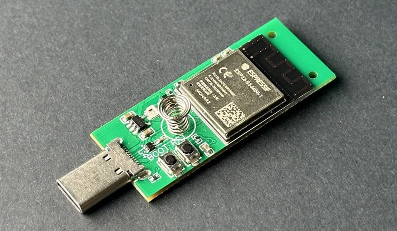
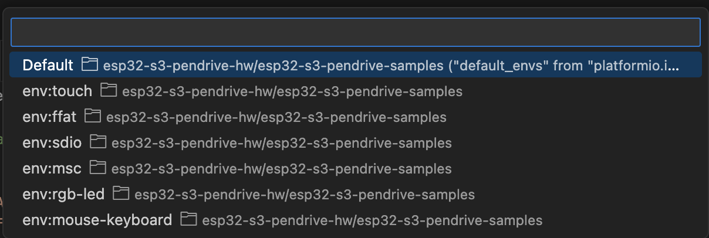

# ThingPulse Pendrive S3

[ThingPulse Pendrive S3](https://thingpulse.com/product/esp32-s3-pendrive-s3-128mb/).

## Projects
* [Sample on Github](https://github.com/ThingPulse/esp32-s3-pendrive-samples)
* [Super WiFi Duck](https://github.com/ThingPulse/SuperWifiDuck)

## Preparing Build Environment
Install VS Studio Code and Platformio [Instructions](https://platformio.org/install/ide?install=vscode)

## Building & Flashing Sample projects
1. Get the sample projects with a `git clone https://github.com/ThingPulse/esp32-s3-pendrive-samples`
2. Choose a sample project by selecting a target from the footer: 
3. Press the Build & Flash button from the footer of VS Code

For some samples it might be necessary to get the device into bootloader mode:
1. Press & hold the boot button
2. Press & release the reset button, while holding the boot button
3. Release the boot button

After flashing the firmware it might be necessary to press reset to get out of bootloader mode.

## Building & Flashing the SuperWiFi Duck project
1. Get the SuperWiFiDuck project: `git clone https://github.com/ThingPulse/SuperWifiDuck`
2. Press the build & flash button in VS Code's footer

To use SuperWiFiDuck follow the instructions in the [repository](https://github.com/ThingPulse/SuperWifiDuck)

## Flashing Circuit Python
Use the web flasher (here)[https://circuitpython.org/board/ThingPulse_PendriveS3/]
Please note: at the moment the web flasher does not work yet, but will be fixed soon.

## Links
[Documentation on Github](https://github.com/ThingPulse/thingpulse-devices/tree/master/pendrive-s3)

