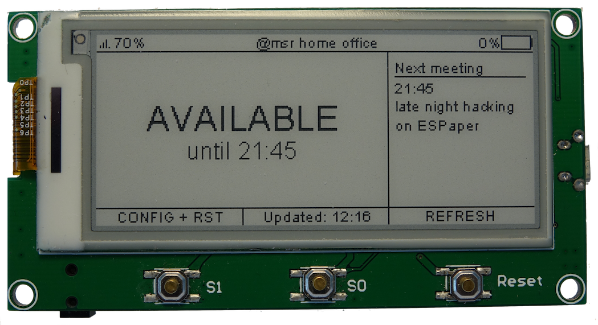
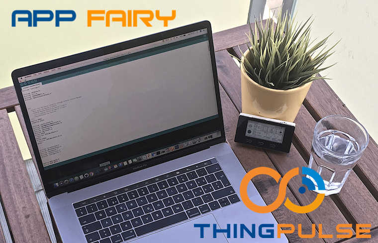
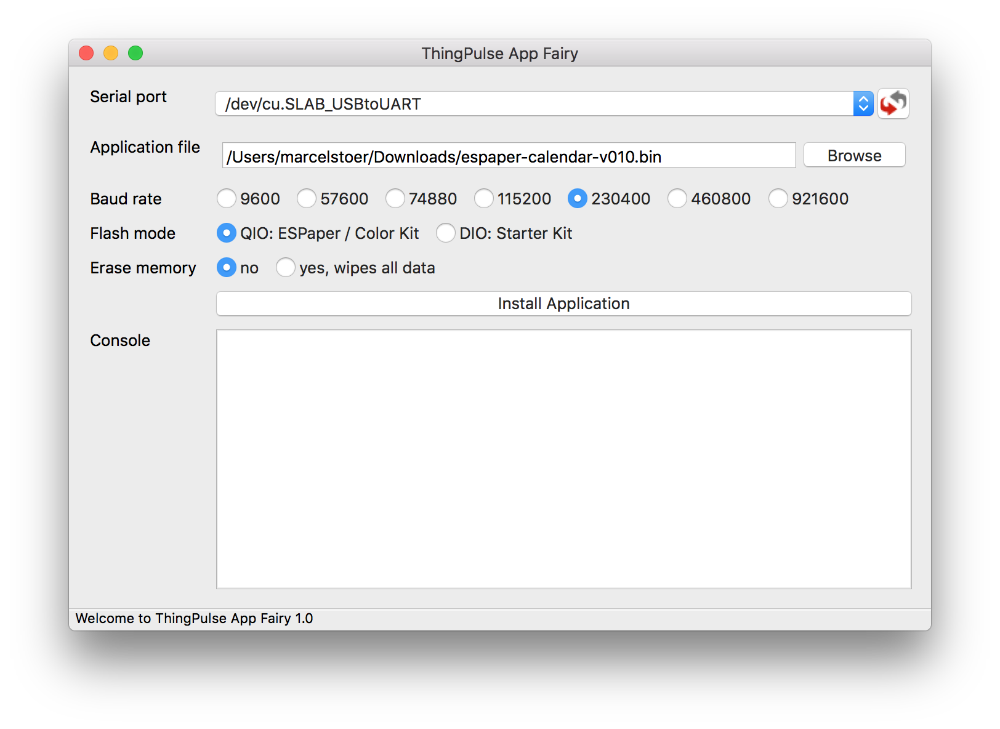

# ESPaper Calendar

How to install and configure the ThingPulse ESPaper Calendar app on an ESPaper [Plus Kit](https://thingpulse.com/product/2-9-espaper-plus-kit/) or [Lite Kit](https://thingpulse.com/product/2-9-espaper-lite-kit/).

---

!!! note
    Study the chapter on supported calendars carefully before you proceed. It may safe you a lot of time and frustration.

## Architecture and supported calendars

ESPaper Calendar supports data loaded from any valid [iCalendar](https://en.wikipedia.org/wiki/ICalendar) resource. Such files or URLs normally end in `.ical` or `.ics` but this is more of a convention than a requirement. 

### Operating environment

For a number of reasons your device can not load and process calendar data directly. ESP8266-based devices (such as ESPaper) are constrained by two primary factors: CPU speed and available memory (<40KB). As ESPaper devices are intended to run unplugged off a battery they further have to keep energy consumption down to an absolute minimum.

Calendar "files" can be arbitrarily large; size depends on the number of events and the data attached to it (description etc.). It is not uncommon for real-life corporate calendars to be a few 100KB large. Hence, most calendars will far exceed the available system memory. Due to the nature of the iCalendar format and its support for recurring events a large part of its data needs to be available in memory while parsing. Hence, one cannot just read the calendar line by line and throw-away what has already been processed.

Also, the device needs to keep on-air time (i.e. connect to WiFi, transferring data) down to seconds or preferably a few 100 milliseconds. The battery will otherwise drain way too quickly.

### Architecture

For the reasons outlined above the bulk of calendar processing is done on a high-power server rather than on the device. It parses the calendar, cleans data, handles all the tricky time, date, and timezone calculations and evaluates the rules for recurring events. All with the goal of forwarding only a very limited set of pre-processed events to the device - those relevant for the current time frame.

ThingPulse runs a small application for the above tasks on its hosting infrastructure in a Swiss data center. While in theory we thus would have access to your calendar data **we guarantee that our application neither saves, logs or otherwise records your data**. This applies to both calendar data and calendar URL.

Please [contact us](https://thingpulse.com/about/contact/) if do not see your privacy concerns adequately addressed.

### Supported Calendars

Your calendar has to be **publicly available over the internet** and be hosted with one of **the following providers**

- Google Calendar, URLs like https://calendar.google.com/*
- Apple iCloud, URLs like https://\*calendars.icloud.com/*
- Microsoft Outlook.com, URLs like https://outlook.live.com/owa/*

Calendars from those three providers are tested and known to be working fine. Please [get in touch with us](https://thingpulse.com/about/contact/) if your calendar is hosted somewhere else or if Google & Co. assigned a URL to your calendar that does not match the above patterns. Given it passes a few smoke tests we can add your calendar to the list of whitelisted calendars in no time.

## Hardware setup

### Requirements

Any ESPaper [Plus Kit](https://thingpulse.com/product/2-9-espaper-plus-kit/) or [Lite Kit](https://thingpulse.com/product/2-9-espaper-lite-kit/) will do. No further requirements.

### Install drivers
{!../includes/install-drivers.md!}

### Connect the programmer / USB-to-serial converter

Plug in the programmer with the electronic components on its PCB facing down/back. The `+5V` plug has to go onto the `5V` pin on
the ESPaper as per the photos below.

The programmer provides enough power to drive the ESPaper while you are programming it. However, it is more efficient
 to use the USB port to charge the battery than to use the programmer for this purpose.
 
!!! note
    Don't forget to connect host system and programmer with an USB cord and turn on the ESPaper module (on/off switch).

!!! danger
    Do NOT power the device via USB port and programmer simultaneously.

## Software setup

### Download ESPaper Calendar app

[Download](https://calendar.espaper.com/releases/thingpulse-espaper-calendar-v1-rc3.bin) the latest version of the ESPaper Calendar app.

### ThingPulse App Fairy

The App Fairy is a standalone and self-contained desktop application that transfers a ThingPulse application to your device.

#### Download

Download the latest version of ThingPulse App Fairy for Windows or macOS from GitHub: [https://github.com/ThingPulse/app-fairy/releases](https://github.com/ThingPulse/app-fairy/releases).

Unfortunately there are no pre-built binaries for Linux available yet. Customers on Linux can still run this Python application but they need to [install the required dependencies first](https://github.com/ThingPulse/app-fairy#build-it-yourself).

#### Transfer ESPaper Calendar app

In order to accept new software being transferred via the serial adapter the device has be in "flash mode":

- Press and HOLD the center button
- Press and RELEASE the right button
- Release the center button

Start the App Fairy and proceed as follows:

1. Select the serial port the system assigned to your device. On macOS the serial devices are called `/dev/cu.xxx`. On a PC it should be listed as a COM port labelled `COM#` (where # is some number).
1. Select the ESPaper Calendar application file that you downloaded earlier.
1. Set the flash mode to QIO.
1. Set ==Erase memory== to `yes` if you had previously installed other applications (e.g. our weather station) on your device. Select `no` if
	*  you are installing a new ESPaper Calendar version
	*  the device is empty, has no application installed
1. Hit the install button.

!!! warning
    The device must not be in deep sleep mode when you start the transfer.

Now reset the device as instructed in the App Fairy console.

  
### Configure ESPaper Calendar app

When you first install the ESPaper Calendar application it's missing the WiFi and calendar configuration (unless you just updated to a new version). Whenever the device cannot connect to the configured WiFi or if its configuration is missing it will display instructions how to put the device into config mode:

- Press and HOLD the left button
- Press and RELEASE the right button
- Release the left button
- Wait a few seconds

You will then see instructions on the display how to load the config portal:

- On your computer, tablet or smartphone connect to the WiFi network ==ESPaperConfig==. This network is created by the access point now running on the device during config mode.
- In a browser navigate to address ==192.168.4.1==

The browser will show a form similar to the one below. Proceed to filling in your details.

    
    <h4>Options</h4>
    

    Note that your device's MAC address is displayed in the 'Device Information' block in case it needs to be whitelisted for WiFi access.
    

    <h5>Calendar URL</h5>
    
If you haven't done so please read <a href="#architecture-and-supported-calendars">the top chapter</a> about architecture and calendar URLs. Remember: the URL needs to be publicly available over the internet!

    <h5>Sleep interval</h5>
    
Thanks to the characteristics of the <a href="https://en.wikipedia.org/wiki/Electronic_paper" target="_blank">e-ink/e-Paper display</a> your device sleeps for most of the time (very low power consumption) and only wakes up to update the display. The longer the sleep interval to longer your device runs on a single battery charge.

    
The ESPaper Calendar application uses a smart-wakeup algorithm to wake the device even before the sleep timer is up if necessary. If it is awake at let's say 9:28 and it notices that the free/busy state of your resource will change at 9:30 it will not sleep for the whole configured interval but will wake up at 9:30 to update the display.

    <h5>Time zone and network time</h5>
    
It is important you set the correct time zone as date calculations will otherwise be completely off - regardless of what the original timestamps in the calendar are.

    
Whenever the device wakes up it briefly synchronizes its internal timer with one of the NTP servers derived from the time zone. It is best to leave the list of servers untouched unless the network the device is connected to blocks access to those servers. You could then configure a comma-separated list of custom servers.

​