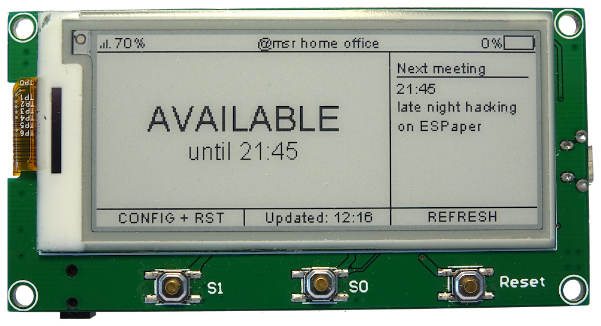

# ESPaper Calendar

How to install and configure the ThingPulse ESPaper Calendar app on an ESPaper [Plus Kit](https://thingpulse.com/product/2-9-espaper-plus-kit/) or [Lite Kit](https://thingpulse.com/product/2-9-espaper-lite-kit/).

---

## Hardware

Any ESPaper [Plus Kit](https://thingpulse.com/product/2-9-espaper-plus-kit/) or [Lite Kit](https://thingpulse.com/product/2-9-espaper-lite-kit/) will do. No further requirements.

### Install drivers
{!../includes/install-drivers.md!}

### Connect the programmer / USB-to-serial converter

Plug in the programmer with the electronic components on its PCB facing down/back. The `+5V` plug has to go onto the `5V` pin on
the ESPaper as per the photos below.

The programmer provides enough power to drive the ESPaper while you are programming it. However, it is more efficient
 to use the USB port to charge the battery than to use the programmer for this purpose.
 
!!! note
    Don't forget to connect host system and programmer with an USB cord and turn on the ESPaper module (on/off switch).

## Software

### Download ESPaper Calendar app

Download the version of the ESPaper Calendar app from [TBD](https://tbd.org).

### ThingPulse App Fairy

The App Fairy is a standalone and self-contained desktop application that transfers a ThingPulse application to your device.

#### Download

Download the latest version of ThingPulse App Fairy for Windows or macOS from GitHub: [https://github.com/ThingPulse/app-fairy/releases](https://github.com/ThingPulse/app-fairy/releases).

Unfortunately there are no pre-built binaries for Linux available yet. Customers on Linux can still run this Python application but they need to [install the required dependencies first](https://github.com/ThingPulse/app-fairy#build-it-yourself).

#### Transfer ESPaper Calendar app

Start the App Fairy and proceed as follows:

1. Select the serial port the system assigned to your device. On macOS the serial devices are called `/dev/cu.xxx`. On a PC it should be listed as a COM port labelled `COM#` (where # is some number).
1. Select the ESPaper Calendar application file that you downloaded earlier.
1. Set the flash mode to QIO.
1. Set ==Erase memory== to `yes` if you had previously installed other applications (e.g. our weather station) on your device. Select `no` if
	*  you are installing a new ESPaper Calendar version
	*  the device is empty, has no application installed
1. Hit the install button.

  
### Configure ESPaper Calendar app
TBD