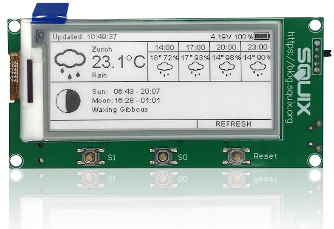

# 2.9″ ESPaper Lite Kit

How to assemble and program the [ThingPulse ESPaper Lite Kit](https://thingpulse.com/product/2-9-espaper-lite-kit/). 

---

The ThingPulse ESPaper Lite Kit is the more bare-bone version of its bigger sister the ESPaper Plus Kit. As it is 
intended for more tech-savvy customers who are not IoT novices there is no specific guide for the Lite Kit. Instead 
customers should read the [Plus Kit guide](espaper-plus-kit.md) and skip the chapters they are already familiar with.
