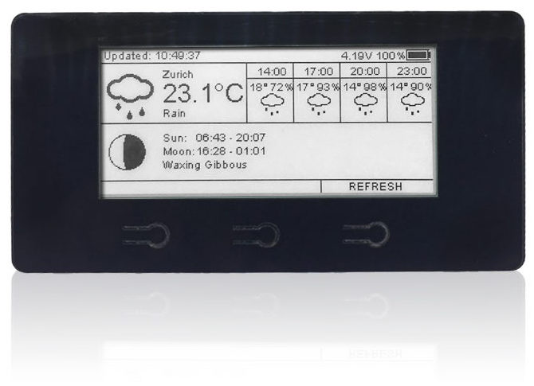
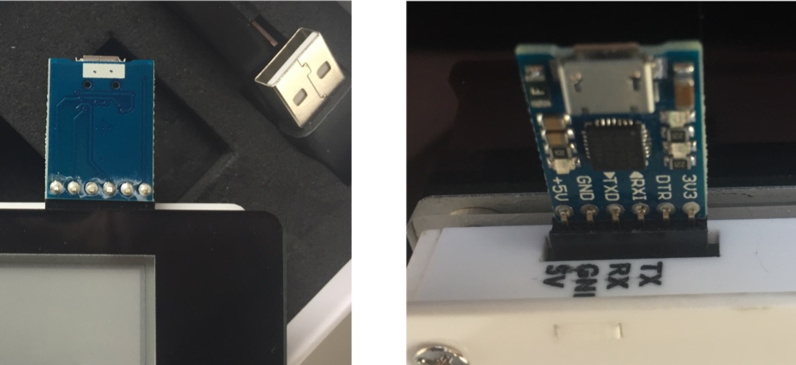
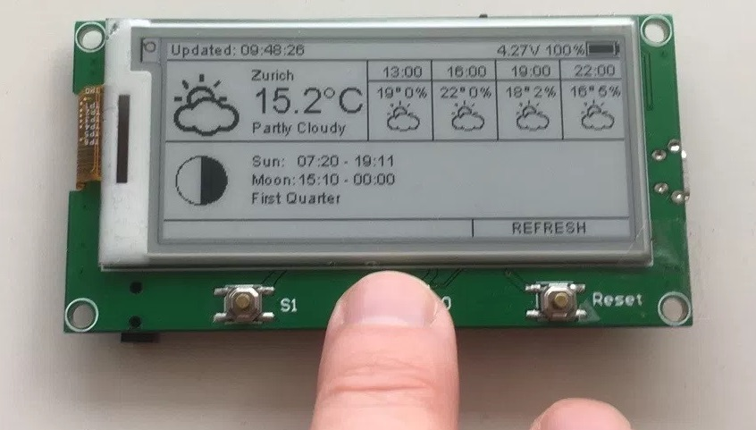

# 2.9″ ESPaper Plus Kit

How to assemble and program the [ThingPulse ESPaper Plus Kit](https://thingpulse.com/product/2-9-espaper-plus-kit/).

---

## Hardware

In order to save as much energy as possible during regular usage we decided to separate the USB-to-Serial converter
from the display module. This means that we need an external device, included in the kit, to re-program the display
device. You can of course use any other USB-to-Serial converter which supports 3V3 logic levels just as well.

### Install drivers
{!../includes/install-drivers.md!}

## Software

### Prepare Arduino IDE for ESP8266
{!../includes/Arduino-IDE.md!}

#### Install the ESP8266 toolchain
{!../includes/ESP8266-for-Arduino-IDE.md!}

#### Connect the programmer / USB-to-serial converter

It’s now time to connect the USB-to-serial converter, which came with the ESPaper Plus Kit, to the ESPaper. Plug in the
programmer with the electronic components on its PCB facing down/back. The `+5V` plug has to go onto the `5V` pin on
the ESPaper as per the photos below.

The programmer provides enough power to drive the ESPaper while you are programming it. However, it is more efficient
 to use the USB port to charge the battery than to use the programmer for this purpose.
 
!!! note
    Don't forget to connect host system and programmer with an USB cord and turn on the ESPaper module (on/off switch).
 
!!! danger
    Do NOT power the device via USB port and programmer simultaneously.

#### Select board and serial port
{!../includes/select-board-and-serial-in-Arduino-IDE.md!}

Now open the serial console in the Arduino IDE and see if there is output when you turn the ESPaper module on (e.g.
by using the ON/OFF switch). This can look like garbage, but if you see characters your computer is capable of
talking to the device.

#### Select flash mode and flash size

The [ESP-WROOM-02 chip](https://www.espressif.com/en/products/hardware/esp-wroom-02/overview) used by the ESPaper Kits has an embedded 2 MB SPI flash memory. It hosts the SPIFFS file system the application will later write files to.

- in ==Tools== > ==Flash Mode== select "QIO"
- in ==Tools== > ==Flash Size== select "2M (1M SPIFFS)"

The application might fail to transfer or fail to start if the flash options are not configured properly.

#### Install libraries

The ThingPulse ESPaper depends on a number of other libraries. They need to be made available to the Arduino IDE for
them to be compiled and linked into the final application.

Go to ==Sketch== > ==Include Library...== > ==Manage Libraries...==. Then, for each library, put its name into the
text field to have its metadata pulled from the internet and displayed below. Select the latest version and install
it. Make sure to come back to this dialog from time to time to keep each library up to date. Also make sure that you
only have one version of each of the libraries installed.

- [Mini Grafx](https://github.com/ThingPulse/minigrafx) by Daniel Eichhorn
- [ESP8266 WeatherStation](https://github.com/ThingPulse/esp8266-weather-station) by Daniel Eichhorn
- [Json Streaming Parser](https://github.com/squix78/json-streaming-parser) by Daniel Eichhorn
- [simpleDSTadjust](https://github.com/neptune2/simpleDSTadjust) by neptune2

### Create OpenWeatherMap API key

{!../includes/openweathermap-key.md!}

## ESPaper project

With all the preparation done you will - finally, sigh - turn to the ESPaper weather station project itself.
Fortunately, this last step is a rather simple one.

### Obtain the code

The ESPaper weather station project is, as all of ThingPulse's open-source code, publicly accessible on GitHub. Hence,
there are two options to download the code:

- Clone the repository with Git: `git clone https://github.com/ThingPulse/espaper-weatherstation`
- Download the sources from https://github.com/ThingPulse/espaper-weatherstation/archive/master.zip and unpack
 them somewhere to your local file system

### Open project in Arduino IDE

- Start the Arduino IDE
- ==File== > ==Open==
- find and select [`espaper-weatherstation.ino`](https://github.com/ThingPulse/espaper-weatherstation/blob/master/espaper-weatherstation.ino)
from the previous step.

### Configuration & customization

In one of the tabs the IDE opened [`settings.h`](https://github.com/ThingPulse/espaper-weatherstation/blob/master/settings.h).
Go through the file and adjust the two handful of configuration parameters. They are all documented _inside_ the file
directly. Everything should be self-explanatory. Most importantly you will need to set the OpenWeatherMap API key you
obtained in a previous step.

Replace `WIFI_SSID` with the name of your WiFi network and `WIFI_PASS` with its password. While there are nice
tools like the WifiManager which avoid storing the WiFi credentials in the firmware but they also take more time to
connect to WiFi, which in turns reduces your battery life.

Copy the OpenWeatherMap API key you got in the previous step and assign it to `OPEN_WEATHER_MAP_APP_ID`.

Change the `UTC_OFFSET` field according to your time zone. The value is the number of hours your timezone is ahead
or behind UTC/GMT. If you are not sure about the DST rules [look them up](https://en.wikipedia.org/wiki/Daylight_saving_time_by_country).

### Put ESPaper into programming mode

When we designed the ESPaper we valued energy efficiency higher than convenience for users. Of course, in the long run
high efficiency is convenient as well as it reduces the re-charge interval. However, this means that the ESPaper
module does not have this nice circuit which puts the integrated ESP8266 into programming mode when you click the
upload button in the Arduino IDE. In order to program the chip we have to put it into programming mode manually.
Below image is from an [ESPaper Lite Kit](https://thingpulse.com/product/2-9-espaper-lite-kit/) but the process is
the same:

1. Press button ==S0==
1. Hold it down while pressing ==RESET==
1. Release ==RESET==
1. Release ==S0==

### Upload code to device

The very last step really is to upload the code and all its dependencies to the device from the Arduino IDE. You do
this through CTRL + U (⌘ + U on macOS) or ==Sketch== > ==Upload== or the right-arrow icon in the toolbar.

Should this fail make sure that there is a port selected in the tools menu. Disconnect the module from the programmer
and reconnect it. Make sure that they are connected correctly. Put it into programming mode again.
