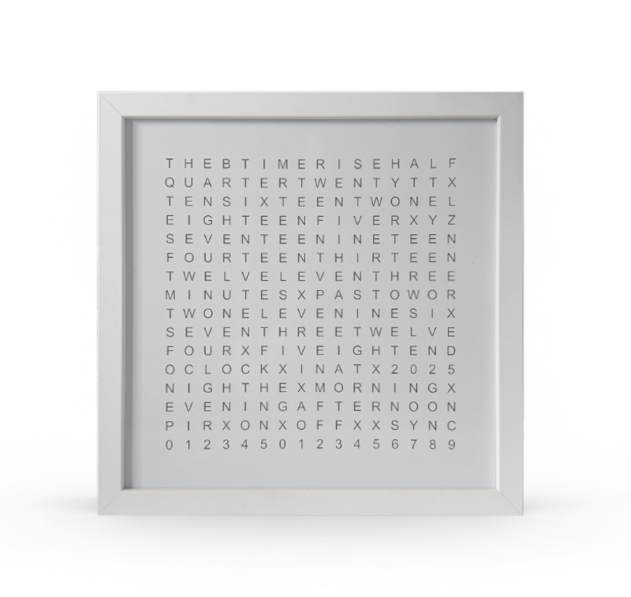
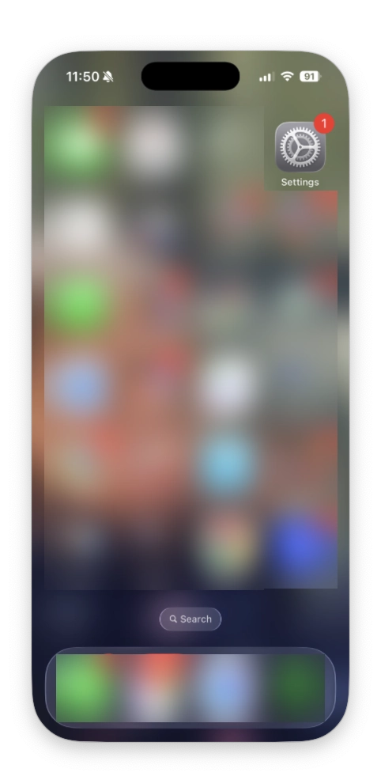
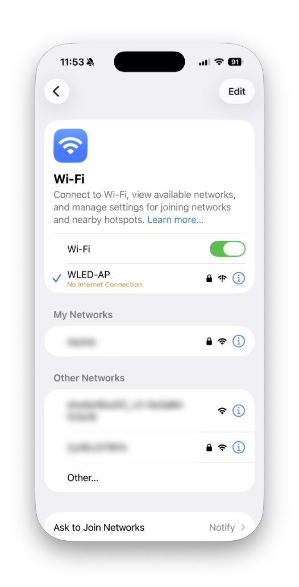
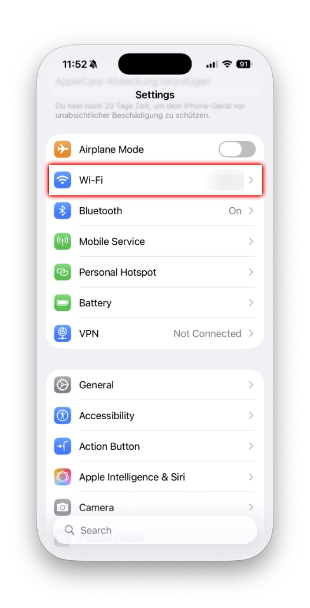
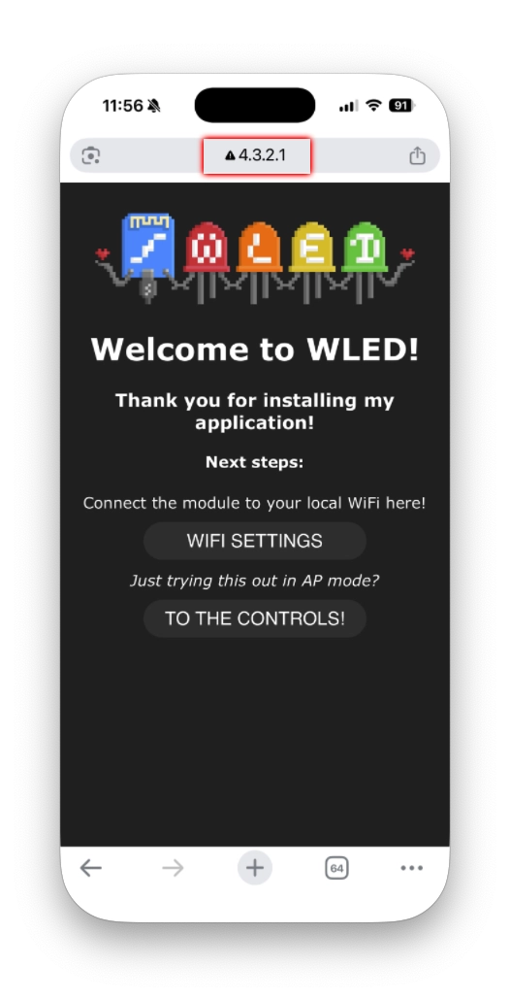
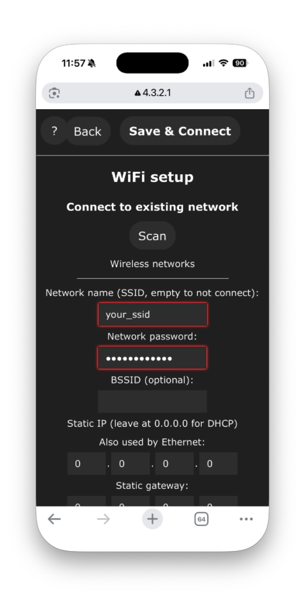

# Icon256 - Word Clock

How to set up and configure the [ThingPulse Icon256 - Word Clock](https://thingpulse.com/product/icon256-word-clock/).

---

The Icon256 - Word Clock comes pre-programmed with a modified version of [WLED](https://kno.wled.ge/), a powerful and feature-rich firmware for controlling addressable LED strips. This guide will help you get your word clock up and running in minutes.

## Quick Start

### Power On

Connect the Icon256 - Word Clock to a USB-C power source (5V, at least 1A recommended). The word clock will power on automatically and display a default animation.

### Connect to WiFi

When powered on for the first time, the Icon256 creates its own WiFi access point for easy configuration. Follow these steps:

1. **Quick connect with QR code**: Scan this QR code with your smartphone to connect automatically to the access point:

   

   *Alternatively, if the QR code doesn't work:* Manually find and connect to the WiFi network named `WLED-AP` (or similar, may include the device's chip ID) using the password `wled1234`

2. **Follow the visual setup guide**: Click on any image below to view the setup steps in a carousel. Use arrow keys or click the arrows to navigate between steps.

{ data-title="Step 1: Open Settings" data-description="Your device should automatically open a captive portal. If not, navigate to http://4.3.2.1" }

{ data-title="Step 2: WiFi Setup" data-description="Click on the WIFI SETUP button to access network settings" }

{ data-title="Step 3: Configure WiFi" data-description="Select your home WiFi network, enter password, and click Save & Connect" }

{ data-title="Step 4: Connected" data-description="The Icon256 will restart and connect to your network" }

{ data-title="Step 5: WiFi Selection" data-description="Reconnect your phone to your regular WiFi network" }

!!! tip
    Write down the IP address shown on the configuration page. You can access the WLED interface anytime by entering this IP address in your browser while connected to the same WiFi network.

### Install the WLED App

For the best mobile experience, install the official WLED app on your smartphone:

**For iOS:**

1. Open the [App Store](https://apps.apple.com/ch/app/wled-native/id6446207239)
2. Search for "WLED" by Christophe Ganier
3. Download and install the app
4. Open the app - it will automatically discover your Icon256 if it is on the same WiFi network

**For Android:**

1. Open the [Google Play Store](https://play.google.com/store/apps/details?id=ca.cgagnier.wlednativeandroid)
2. Search for "WLED" by Christian Schwinne
3. Download and install the app
4. Open the app - it will automatically discover your Icon256 on the network

!!! note
    Make sure your phone is connected to the same WiFi network as your Icon256 - Word Clock.

### Select the Word Clock Effect

The Icon256 comes with a special word clock effect pre-configured. To activate it:

#### Using the Web Interface:

1. Open a web browser and enter the IP address of your Icon256
2. In the main interface, click on the **Effects** tab (FX icon)
3. Scroll through the effect list and select **"Word Clock"**
4. The display will immediately switch to word clock mode, showing the current time

#### Using the WLED App:

1. Open the WLED app
2. Tap on your Icon256 device from the discovered devices list
3. Tap on the **Effects** button (star/sparkle icon)
4. Scroll down and select **"Word Clock"**
5. The time will now be displayed in words on your Icon256

### Set the Time Zone

For the word clock to display the correct time, you need to configure your time zone:

#### Using the Web Interface:

1. In the WLED web interface, click on the **Config** button (gear icon)
2. Select **Time & Macros**
3. In the **Time setup** section:
   - Enable **"Get time from NTP server"** checkbox
   - **NTP Server**: Use the default (`0.wled.pool.ntp.org`) or enter your preferred NTP server
   - **Timezone**: Enter your timezone offset in seconds, or use the UTC offset format
     - Example for PST (UTC-8): `-28800` or select from common timezone list
     - Example for CET (UTC+1): `3600`
     - Example for EST (UTC-5): `-18000`
   - **UTC offset**: Alternatively, set hours and minutes offset from UTC
4. Click **Save** at the bottom of the page
5. The Icon256 will synchronize with the NTP server and display the correct local time

#### Using the WLED App:

1. In the WLED app, tap on the device
2. Tap the **Settings** icon (three dots or gear icon)
3. Select **Time & Macros**
4. Configure the same settings as described above
5. Tap **Save**

!!! tip "Timezone Examples"
    - **Pacific Time (PST/PDT)**: UTC offset = -8 hours (-28800 seconds)
    - **Mountain Time (MST/MDT)**: UTC offset = -7 hours (-25200 seconds)
    - **Central Time (CST/CDT)**: UTC offset = -6 hours (-21600 seconds)
    - **Eastern Time (EST/EDT)**: UTC offset = -5 hours (-18000 seconds)
    - **Central European Time (CET/CEST)**: UTC offset = +1 hour (3600 seconds)
    - **UK Time (GMT/BST)**: UTC offset = 0 hours (0 seconds)

### Adjust Brightness

You can easily adjust the brightness to suit your environment:

- **Web Interface**: Use the brightness slider at the top of the main page
- **WLED App**: Use the brightness slider in the main control screen
- **Physical Button** (if your Icon256 has one): Short press to toggle on/off, long press to cycle through brightness levels

## Advanced Features

### Customization Options

The Word Clock effect offers several customization options:

1. **Color Selection**: Change the color of the displayed words
   - Tap the color palette icon
   - Choose your preferred color or create a custom one
2. **Background Color**: Some word clock variants allow setting a background color for the non-lit words
3. **Effect Intensity & Speed**: Adjust these sliders to modify the transition effects between time changes

### Presets

Save your favorite configurations as presets:

1. Configure the word clock effect with your preferred colors and settings
2. Click on **Presets** (bookmark icon)
3. Click **Save to ID** and choose an empty preset slot
4. Give it a descriptive name (e.g., "Blue Word Clock")
5. Access your presets anytime with one click

### Automatic Scheduling

You can schedule your word clock to turn on/off automatically:

1. Go to **Config** > **Time & Macros**
2. Scroll to **Time-controlled presets**
3. Set up to 10 different scheduled actions
   - Choose times and days of the week
   - Select presets or actions to trigger (e.g., turn off at night, turn on in the morning)

### Over-the-Air (OTA) Updates

Keep your WLED firmware up to date:

1. Go to **Config** > **Security & Updates**
2. Click **Manual OTA Update**
3. The system will check for updates and allow you to install the latest version

!!! warning
    Do not power off the device during an update. Ensure you have a stable power supply.

## Troubleshooting

### Word Clock Not Showing Correct Time

- Verify your timezone offset is correct
- Ensure the Icon256 has internet access to reach the NTP server
- Try manually syncing: Config > Time & Macros > click the sync button

### Cannot Connect to WiFi

- Ensure you entered the correct WiFi password
- Check that your WiFi network uses 2.4GHz (the ESP32 does not support 5GHz networks)
- Move the Icon256 closer to your WiFi router
- Try resetting the WiFi settings by powering off, waiting 10 seconds, then powering back on

### Device Not Discovered in App

- Confirm both your phone and Icon256 are on the same WiFi network
- Check your router settings - some routers isolate wireless clients from each other (AP isolation)
- Try manually adding the device by IP address in the WLED app

### Reset to Factory Settings

If you need to completely reset your Icon256:

1. Go to **Config** > **Security & Updates**
2. Click **Factory Reset**
3. Confirm the action
4. The device will restart with default settings

## Support

If you need help at any point with the Icon256 - Word Clock, please reach out to ThingPulse and their community through [https://support.thingpulse.com/](https://support.thingpulse.com/).

## Additional Resources

- [WLED Official Documentation](https://kno.wled.ge/)
- [WLED GitHub Repository](https://github.com/Aircoookie/WLED)
- [ThingPulse Support Portal](https://support.thingpulse.com/)
