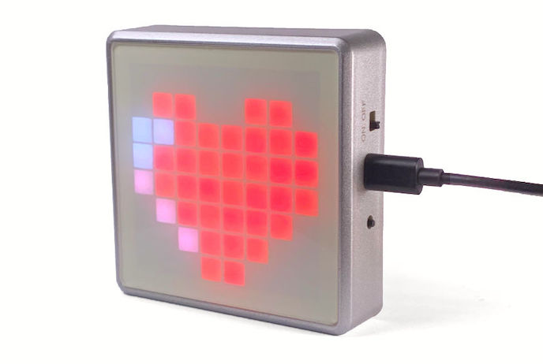
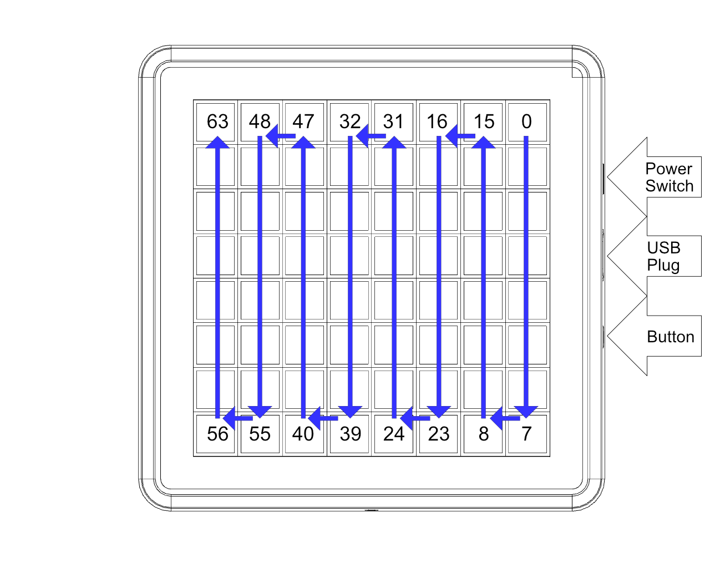
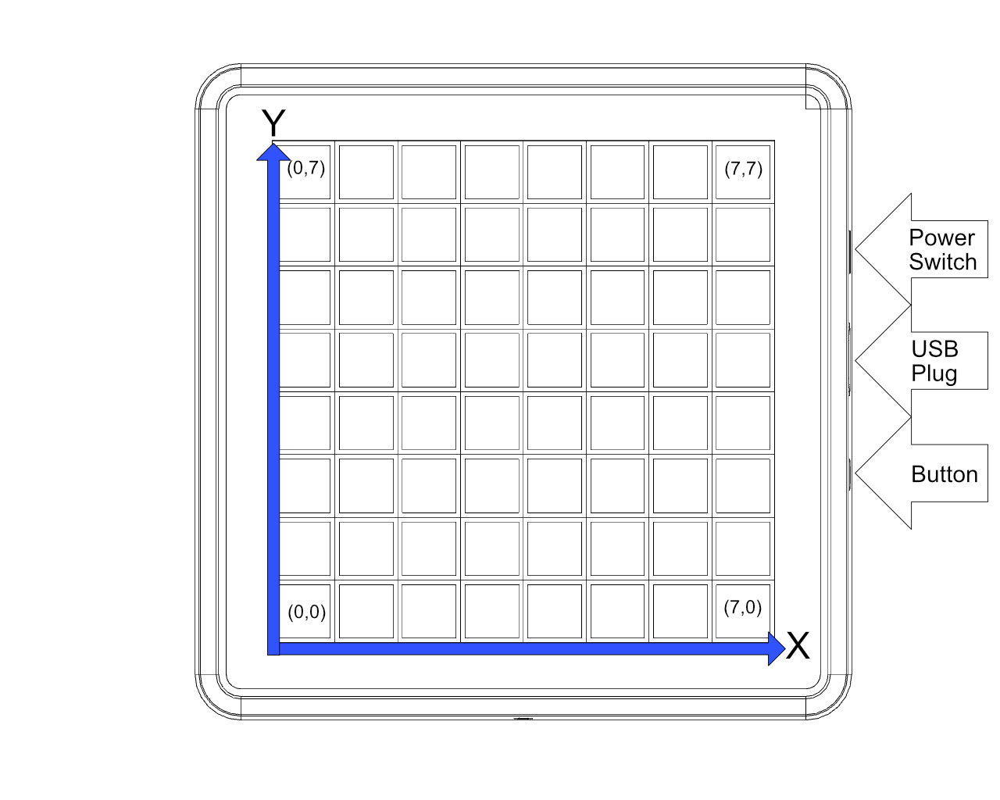

# Icon64 - ESP32 with RBG LED & audio

How to configure and hack the [ThingPulse Icon64](https://thingpulse.com/product/icon64/).



See [Icon64 projects](#icon64-projects) for a list of applications provided by ThingPulse.

## Using the Stock Firmware

Icon64 ships with stock firmware pre-installed. It turns the Icon64 into a Bluetooth speaker with integrated 8 band spectrum analyzer.

To get started simply connect the device to a USB power source. Then use the power switch on the side to turn the device on. The device will display a pulsing heart like shown above. Now open the Bluetooth settings on your smartphone or computer and connect to the device called "ThingPulse-Icon64" and play some music. Watch the following video to see the hole process: 

<iframe width="1280" height="560" src="https://www.youtube.com/embed/1UpbtE98OBA" frameborder="0" allow="accelerometer; autoplay; encrypted-media; gyroscope; picture-in-picture" allowfullscreen></iframe>


## Programming the Icon64

The following chapters describe how you can compile and install applications onto the Icon64. We use the stock firmware as an example but the process is exactly the same for any other application.

For a list of apps provided by ThingPulse see [Icon64 projects](#icon64-projects).

### Install Drivers
{!../includes/install-drivers.md!}

### Install PlatformIO IDE
All ThingPulse Icon64 sample projects are built with PlatformIO. Hence, to use those samples as-is it is required you create a local PlatformIO setup.

{!../includes/platformio.md!}

### Get the Stock Firmware

Now that the driver is installed and Visual Studio Code runs with the PlatformIO plugin you can compile and install the stock firmware.

Get the stock firmware repository either with Git:

```sh
$ git clone  https://github.com/ThingPulse/esp32-icon64-a2dp
```
or by downloading and extracting the ZIP file from that URL.

Once done open the `esp32-icon64-a2dp` folder in Visual Studio Code.

### Upload the Stock Firmware

Please connect your Icon64 to your computer with a USB data cable and turn the device on by sliding the power switch into the "ON" position.

Have a look at the `platformio.ini`. Before you can upload you need to verify and likely adjust the following two lines:

```
upload_port = /dev/cu.SLAB_USBtoUART
monitor_port = /dev/cu.SLAB_USBtoUART
```

They name the USB serial port through which the Icon64 is connected to your computer. The example above works as-is on macOS. On Windows this might be something like COMX with
X being a number between 1 and 9. To figure out what you should place here have a look at the 
[PlatformIO documentation](https://docs.platformio.org/en/latest/projectconf/section_env_upload.html)

Now look for an arrow on the lower left of your Visual Studio Code IDE:


Click this button to download all libraries, to compile the code and to upload the binary to the device.
The first time this process might take a bit longer since PlatformIO needs to download the ESP32
tool chain as well as all required libraries. 

If everything was succesfull you should see an output similar to this one:

``` 
Writing at 0x000a4000... (100 %)
Wrote 1051168 bytes (619238 compressed) at 0x00010000 in 10.9 seconds (effective 768.2 kbit/s)...
Hash of data verified.

Leaving...
Hard resetting via RTS pin...
=========================== [SUCCESS] Took 18.40 seconds ===============================
```

## Hardware Specification

Before you start building your own projects it might make sense you first familiarize yourself with the hardware components. To tinker with the hardware take a look at the [schematic of the board](/specs/Icon64-specification-v1.0.3.pdf).

In order to develop for the Icon64, learn about the following building blocks.

### RGB LEDs

The Icon64 contains 64 WS2812B RGB LEDs in a 3030 package. They are individually addressable over the GPIO32 pin.

The LEDs indexes are as depicted in the following diagram:


The following function lets you use a x-y coordinate system:
```c
uint8_t getLedIndex(uint8_t x, uint8_t y) {
  if (x % 2 == 1) {
    return 63 - (y + x * 8);
  } else {
    return 63 - (7 - y + x * 8);
  }
}
```
This function converts x and y coordinates between (0..7, 0..7) to the index 0..63:



To drive the LEDs we recommend either of the following two libraries: [roboticsbrno/SmartLeds](https://github.com/RoboticsBrno/SmartLeds), [fastled/FastLED](https://github.com/fastled/FastLED).

Let's have a look at how to use the FastLED library:

``` c
#include <Arduino.h>
#include <FastLED.h>

// LED Settings
#define NUM_LEDS          64
#define DATA_PIN          32 

// Define the led chain
CRGB leds[NUM_LEDS];
uint8_t counter = 0;

void setup() {
    Serial.begin(115200);                                    
    FastLED.addLeds<WS2812B, DATA_PIN, GRB>(leds, NUM_LEDS);
}

void loop() {
  FastLED.clear();
  // Activate one pixel after the other 
  // and cycle through the color wheel in HSV
  leds[counter % 64] = CHSV(counter, 255, 100);
  counter = (counter + 1) % 256;
  FastLED.show();
  delay(100);
}
```

### Audio 

The ESP32 is connect over [I²S](https://en.wikipedia.org/wiki/I%C2%B2S) to a [MAX98357a](https://datasheets.maximintegrated.com/en/ds/MAX98357A-MAX98357B.pdf) chip.
The I²S bus requires 3 pins: DOUT, BCLK, and LRC. The mode pin is used to enable audio output with an active high on GPIO33.

| MAX98357a| ESP32  |
| ---      | ---    |
| DOUT     | GPIO25 |
| BCLK     | GPIO26 |
| LRC      | GPIO22 |
| MODE PIN | GPIO33 |

!!! important
    If you do not pull GPIO33 high you won't hear any sound.
    
We recommend either of the following two audio libraries: [schreibfaul1/ESP32-audioI2S](https://github.com/schreibfaul1/ESP32-audioI2S), [earlephilhower/ESP8266Audio](https://github.com/earlephilhower/ESP8266Audio).

### Tactile Switch

The Icon64 also offers a button to control the device. The state of this pin can be read
out on GPIO39. GPIO39 is connected with a 470Ohm pull-up resistor.

A simple but powerful library to handle button presses, long presses, interval presses etc. is [evert-arias/EasyButton](https://github.com/evert-arias/EasyButton). EasyButton allows you to attach callback functions to certain button events. Use callback functions to run specific code when the event gets triggered.

## Icon64 projects

###  Bluetooth speaker
The [Bluetooth speaker](https://github.com/ThingPulse/esp32-icon64-a2dp) is the Icon64 stock firmware. It uses the LEDs to display the output of the integrated 8 band spectrum analyzer.

### Tooth Fairy
The [Tooth Fairy](https://github.com/ThingPulse/esp32-icon64-toothfairy) makes brushing teeth more fun for you and/or your kids. It is a coloful webradio countdown.
### CO₂ Monitor
The [CO₂ Monitor](https://github.com/ThingPulse/esp32-icon64-co2) application requires a [MH-Z19C CO₂ sensor](https://thingpulse.com/product/mh-z19-co2-sensor/) (plug'n play). Displays the current ambient CO₂ level and audiably alerts when defined warn/alert threshholds are reached.

