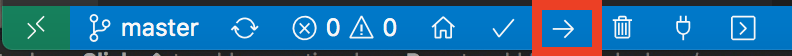

# Icon64 - ESP32 with RBG LED & audio

How to configure and hack the [ThingPulse Icon64](https://thingpulse.com/product/icon64-esp32-with-rgb-matrix-and-audio/).


# Using the stock firmware

The firmware pre-installed on the Icon64 is a bluetooth speaker with integrated 8 band spectrum analyzer. Connect the device
with a power source over USB. Then use the power switch on the side to turn the device on. You should see a pulsing heart now.
Now open the bluetooth settings on your smartphone or computer and connect to the device called "ThingPulse-Icon64" and play
some music. Watch the following video to see the hole process: 

<iframe width="1280" height="560" src="https://www.youtube.com/embed/1UpbtE98OBA" frameborder="0" allow="accelerometer; autoplay; encrypted-media; gyroscope; picture-in-picture" allowfullscreen></iframe>


# Programming the Icon64

## Install drivers
{!../includes/install-drivers.md!}

## Platformio IDE
All Icon64 projects made for using the Platformio IDE

{!../includes/platformio.md!}

## Get Stock Firmware

Now that the driver is installed and Visual Studio Code runs with the Platformio plugin let's try if we can compile and install the stock firmware.
Get the stock firmware repository either with git:

```
git clone  https://github.com/ThingPulse/esp32-icon64-a2dp
```
or by downloading and extracting the zip file.

Once done open the esp32-icon64-a2dp folder in Visual Studio Code.

## Uploading Stock Firmware

Please connect now your Icon64 to your PC by using a USB data cable and turn the device
on by sliding the power switch into the "ON" position.

Have a look at the platformio.ini. Before we can upload we have to check two lines:
```
upload_port = /dev/cu.SLAB_USBtoUART
monitor_port = /dev/cu.SLAB_USBtoUART
```
which devines how to Icon64 is connected with your computer. The example above works fine on my Mac
but it might require a change for your computer. On Windows this might be something like COMX with
X being a number between 1 and 9. To figure out what you should place here have a look at the 
[Platformio Documentation](https://docs.platformio.org/en/latest/projectconf/section_env_upload.html)

Now look for an arrow on the lower left of your Visual Studio Code IDE:


Click this button to download all libraries, to compile the code and to upload the binary to the device.
The first time this process might take a bit longer since the IDE needs to download the ESP32
tool chain as well as all libraries used. 

If everything was succesfull you should see an output similar to this one:
``` 
Writing at 0x000a4000... (100 %)
Wrote 1051168 bytes (619238 compressed) at 0x00010000 in 10.9 seconds (effective 768.2 kbit/s)...
Hash of data verified.

Leaving...
Hard resetting via RTS pin...
=========================== [SUCCESS] Took 18.40 seconds ===============================
```

## Hardware Specifications

Before we start our first project let's have a look at the hardware. [Here](/specs/ICON64%20V1.0.3.pdf) you can 
find the schematic of the board.

For programming the Icon64 you should know about the modules:

### RGB Leds

The Icon64 comes with 64 WS2812B in a 3030 package. They are individually addressable over the GPIO32 pin.

The indices of the LEDs is as depicted in the following diagram:


### Audio 

The ESP32 is connect over I2S protocol with the [MAX98357a](https://datasheets.maximintegrated.com/en/ds/MAX98357A-MAX98357B.pdf) chip.
The I2S bus requires 3 pins, DOUT, BCLK and LRC. The mode pin is used to enable audio output with an active high on GPIO33

- I2S DOUT: GPIO25
- I2S BCLK: GPIO26
- I2S LRC: GPIO22
- MODE PIN: GPIO33

*Note*: Don't forget to pull GPIO33 high or you won't hear any sound.

### Tactile Switch

The Icon64 also offers a button to control the device. The state of this pin can be read
out on GPIO39. GPIO39 is connected with a 470Ohm pull-up resistor

