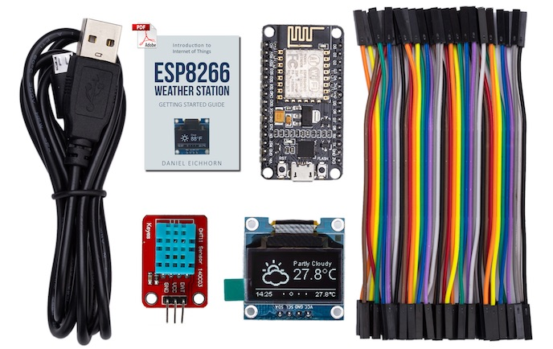

# ESP8266 IoT Starter Kit

How to assemble and program the [ThingPulse ESP8266 IoT Starter Kit](https://thingpulse.com/product/esp8266-iot-electronics-starter-kit-weatherstation-planespotter-worldclock/). 

---

For now we are keeping this documented in a [60+ page PDF](https://blog.squix.org/weatherstation-guide).

