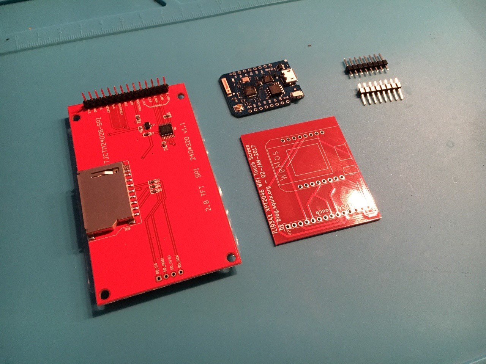
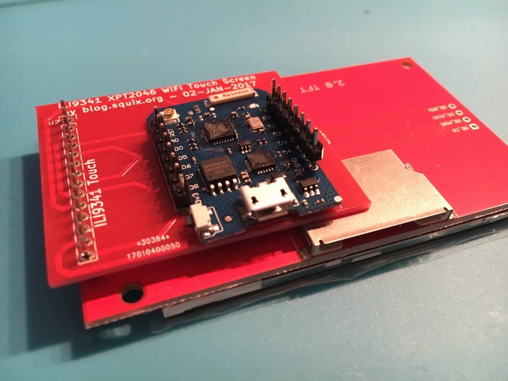
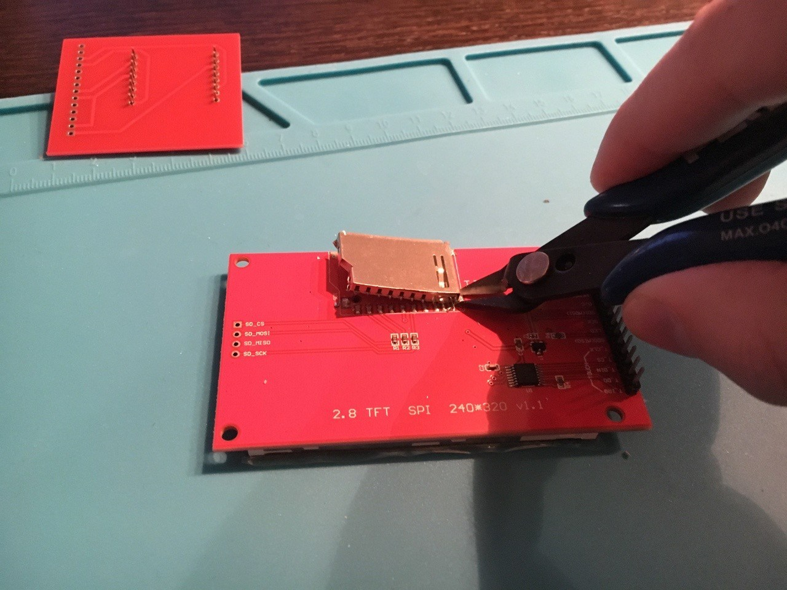
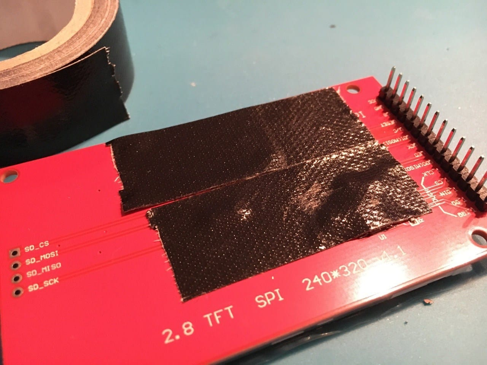
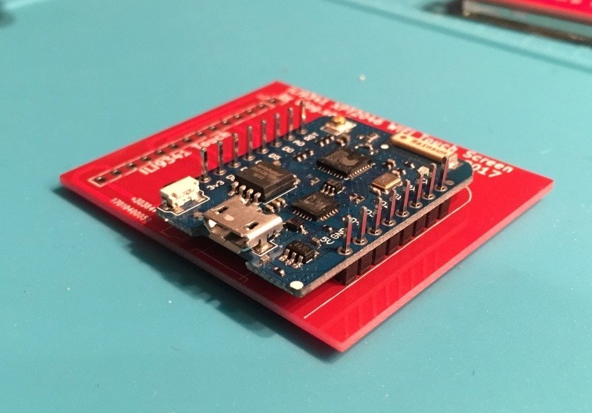
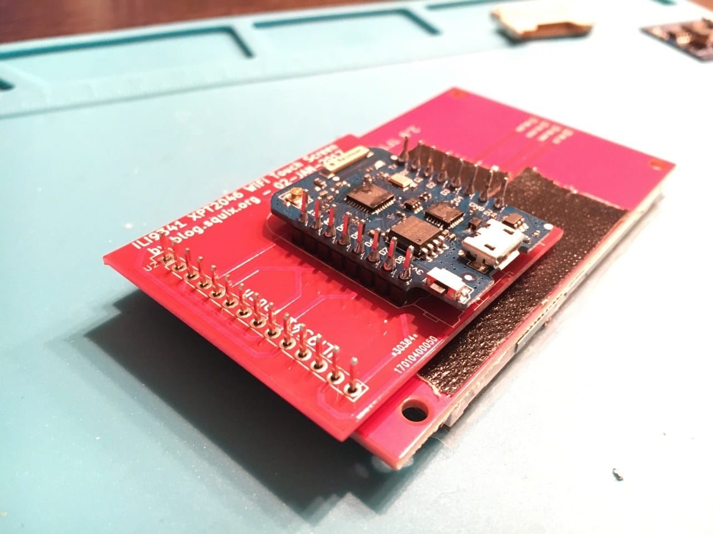

# WiFi Color Display Kit

How to assemble and program ESP8266 WiFi Color Display Kit. 

---

!!! note

    It is advisable to read these instructions carefully *before* you start soldering. In particular please make sure that you have all parts and tools ready.

In addition to the components in the kit you will need:

- soldering iron
- solder
- insulating/electrical/duct tape
- cutting pliers or desoldering braid to remove the SD card holder

## Preparation

### Material inspection
Here is the list of parts: display module (left), custom PCB (bottom right), WeMos D1 mini Pro (top middle) and the two pin header rows.

### Dry run assembly
Stack the parts up as shown below without soldering and make sure it make sense.

While you *could* insert the pin headers into the D1 mini like in the picture consider this: if you turn them upside and insert them with the longer end from underneath the D1 mini it allows you to later add an extension shield on top (there's a picture below). If you do not need that flexibility and want to place the pin headers like in the picture then you need solder them to the D1 mini *first*. D1 mini-plus-headers are then soldered to the PCB. Otherwise the order is reversed.

### Prepare display module

In order to have a display which uses the least amount of space you will want to modify the display module a bit. The SD card holder has to go, sorry. Depending on your (de)soldering skills you can either use a desoldering braid or just cut the SD card holder off of the module with pointy cutting pliers.

### Short circuit prevention

To prevent the D1 mini from accidentally causing a short circuit with the display board you can tape off the area below the connector board.

## Soldering

### Connect PCB and D1 mini

The options of which way to place the pin headers between PCB and the D1 mini were discussed earlier; hope you made up your mind. To achieve what you see below the recommended steps are as follows:

- stack the parts up as shown
- hold the stack between your fingers and flip it over
- solder the pins to the PCB from the back
- flip the stack over and solder the D1 mini from the top

### Connect PCB to display

In the last step of the hardware setup you will solder the connector PCB to the display as shown below.

## Development Environment Setup

tbd, include how-to files

## Weather Station Color Code

tbd