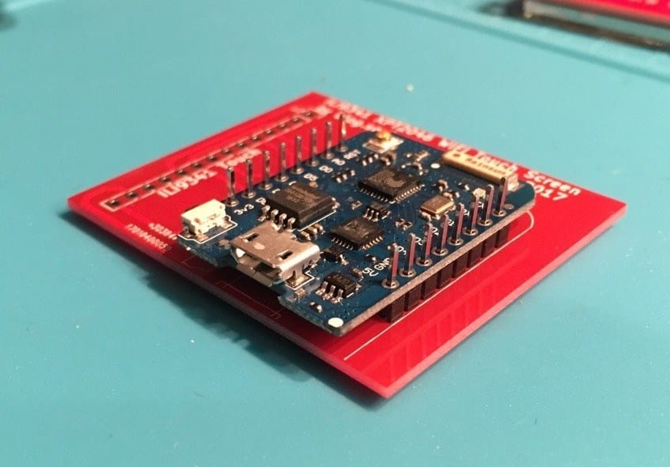

# WiFi Color Display Kit

How to assemble and program the [ThingPulse ESP8266 WiFi Color Display Kit](https://thingpulse.com/product/esp8266-wifi-color-display-kit-2-4/).

---

!!! note

    It is advisable to read these instructions carefully *before* you start soldering. In particular please make sure
     that you have all parts and tools ready.

In addition to the components in the kit you will need:

- [soldering iron](https://thingpulse.com/go/soldering-iron/)
- solder
- insulating/electrical/duct tape
- [cutting pliers](https://thingpulse.com/go/cutting-pliers/) or desoldering braid to remove the SD card holder

If you need help at any point with the following guide do not hesitate to reach out to ThingPulse and their community
 through https://support.thingpulse.com/.

## Preparation

### Material inspection
Here is the list of parts: display module (left), custom PCB (bottom right), WeMos D1 mini (top middle) and the
two pin header rows.

### Dry run assembly
Stack the parts up as shown below without soldering and adjust it until it makes sense.

While you *could* insert the pin headers into the D1 mini like in the picture consider this: if you turned them
upside down and inserted them with the longer end from underneath the D1 mini, this would allow you to later add an
extension shield on top (there's a picture below). If you do not need that flexibility and want to place the pin
headers like in the picture then you need to solder them to the D1 mini *first*. D1 mini-plus-headers are then
soldered to the PCB. Otherwise the order is reversed.

### Prepare display module

*THIS IS OPTIONAL*

In order to get a stack which uses the least amount of space you will want to modify the display module a bit. The
SD card holder has to go, sorry. Depending on your (de)soldering skills you can either use a desoldering braid or
just cut the SD card holder off with pointy cutting pliers.

### Short circuit prevention

To prevent the D1 mini from accidentally causing a short circuit with the display board you can tape off the area
below the connector board.

## Soldering

### Connect PCB and D1 mini

The options of which way to place the pin headers between PCB and the D1 mini were discussed earlier; hope you made
up your mind. To achieve what you see below the recommended steps are as follows:

- stack the parts up as shown
- hold the stack between your fingers and flip it over
- solder the pins to the PCB from the back
- flip the stack back and solder the D1 mini from the top

### Connect PCB to display

In the last step of the hardware setup you will solder the connector PCB to the display as shown below.

Here is a speed-up video with all the steps above. Note how PCB and display are connected in a more "space-generous"
way.

<iframe width="688" height="387" src="https://www.youtube.com/embed/7fbGS4MjoMk?rel=0" frameborder="0"
allow="autoplay; encrypted-media" allowfullscreen></iframe>

## Development Environment Setup

### Install drivers
{!../includes/install-drivers.md!}

### Prepare Arduino IDE for ESP8266
{!../includes/Arduino-IDE.md!}

#### Install the ESP8266 toolchain
{!../includes/ESP8266-for-Arduino-IDE.md!}

#### Select board and serial port
{!../includes/select-board-and-serial-in-Arduino-IDE.md!}

#### Select flash mode and flash size
The WeMos D1 mini module included in this kit has an embedded 4MB SPI flash memory. 3MB of that will be reserved to host a [SPIFFS file system](https://github.com/pellepl/spiffs). If you select the correct board in the IDE the flash mode and flash size settings should get auto-configured. Verify the settings are as follows:

- in ==Tools== > ==Flash Size== select "4MB (FS:3MB OTA:~512KB)"

In older versions of the ESP8266 toolchain (ESP8266 Arduino Core) this was "4M (3M SPIFFS)" or similar.

The application might fail to transfer or fail to start if the flash options are not configured properly. Make sure the menu under ==Tools== looks like this:

#### Install libraries

The ThingPulse Weather Station Color depends on a number of other libraries. They need to be made available to the
Arduino IDE for them to be compiled and linked into the final application.

Go to ==Sketch== > ==Include Library...== > ==Manage Libraries...==. Then, for each library, put its name into the
text field to have its metadata pulled from the internet and displayed below. Select the latest version and install
it. Make sure to come back to this dialog from time to time to keep each library up to date. Also make sure that you
only have one version of each of the libraries installed.

- [Mini Grafx](https://github.com/ThingPulse/minigrafx) by Daniel Eichhorn
- [ESP8266 WeatherStation](https://github.com/ThingPulse/esp8266-weather-station) by Daniel Eichhorn
- [Json Streaming Parser](https://github.com/squix78/json-streaming-parser) by Daniel Eichhorn
- [simpleDSTadjust](https://github.com/neptune2/simpleDSTadjust) by neptune2
- [ThingPulse XPT2046 Touch](https://github.com/ThingPulse/XPT2046_Touchscreen#xpt2046-touchscreen-arduino-library) by ThingPulse (forked from Paul Stoffregen), if you had previously installed the original `XPT2046_Touchscreen` then you need to [uninstall](https://github.com/arduino/Arduino/wiki/Library-Manager-FAQ#how-can-i-delete-a-library) that one!

## Create OpenWeatherMap API key

{!../includes/openweathermap-key.md!}

## Weather Station Color project

With all the preparation done you will - finally, sigh - turn to the Weather Station Color project itself.
Fortunately, this last step is a rather simple one.

**Obtain the code**

The WiFi Color Kit project is, as all of ThingPulse's open-source code, publicly accessible on GitHub. Hence, there
are two options to download the code:

- Clone the repository with Git: `git clone https://github.com/ThingPulse/esp8266-weather-station-color`
- Download the sources from https://github.com/ThingPulse/esp8266-weather-station-color/archive/master.zip and unpack
 them somewhere to your local file system as ==esp8266-weather-station-color== (erase '-master' in the folder name).

**Open project in Arduino IDE**

- Start the Arduino IDE
- ==File== > ==Open==
- find and select [`esp8266-weather-station-color.ino`](https://github.com/ThingPulse/esp8266-weather-station-color/blob/master/esp8266-weather-station-color.ino)
from the previous step.

**Configuration & customization**

In one of the tabs the IDE opened [`settings.h`](https://github.com/ThingPulse/esp8266-weather-station-color/blob/master/settings.h).
Go through the file and adjust the two handful of configuration parameters. They are all documented _inside_ the file
directly. Everything should be self-explanatory. Most importantly you will need to set the OpenWeatherMap API key you
obtained in a previous step.

**Upload code to device**

The very last step really is to upload the code and all its dependencies to the device from the Arduino IDE. You do
this through CTRL + U (⌘ + U on macOS) or ==Sketch== > ==Upload== or the right-arrow icon in the toolbar.
